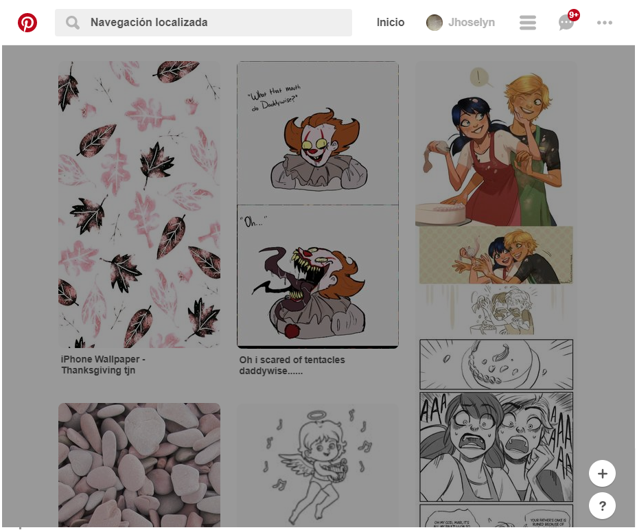
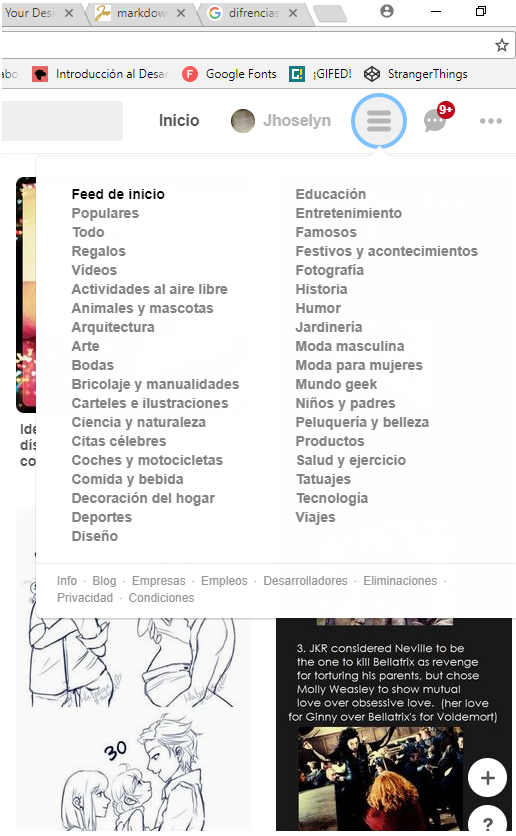
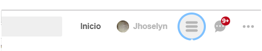
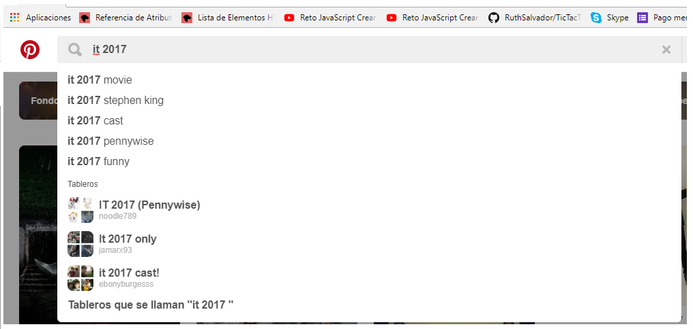
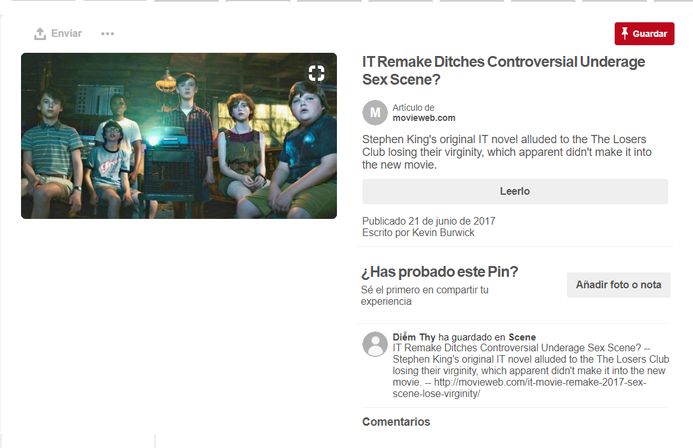
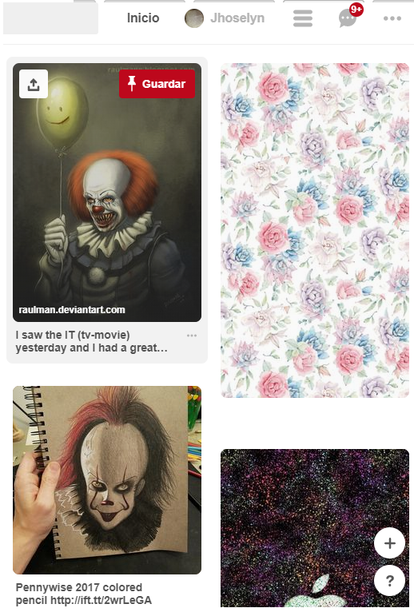

°Pinterest
Algunas partes de la pagina se consideran UI por estas razones:

-Navegacion localizada-ya que tiene un buscador dentro de la pagina web que ayuda al usuario a explorar mejor la busqueda que desea realizar.

-Subnavegacion 

-Botones

-Esquinas redondeadas

-Entradas de texto

-Texto alternativo

-Estados de hover e iconografias

Algunas partes de la pagina se consideran UI por estas razones:

Antes que nada UI es la vista que permite a un usuario interactuar de manera efectiva con un sistema. Es la suma de una arquitectura de información + elementos visuales + patrones de interacción.

-Se puede apreciar que en la pagina de Pinterest

El diseño de interaccion (acerca de como responde el sistema)

Diseño de elementos (Por los botones, y los formularios para registrarse)

Diseño visual (iconos, imagenes)

Guias de estilo(Paletas de color y fuentes)
